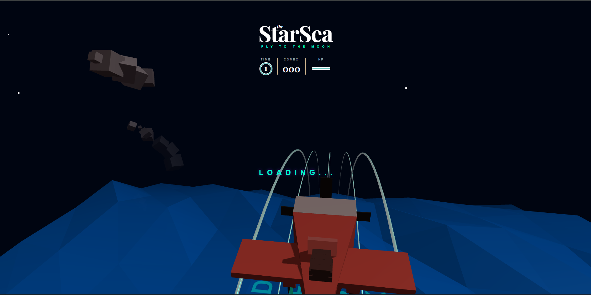

# StarSea_Airplane
Computer Graphics

`실행방법 : 터미널에 npm run dev -> 나오는 링크를 들어가서 플레이 할 것.`

## 1. 프로젝트 개요 및 기획
최대한 원본과 유사하나, 다른 식의 게임을 만들고자 하였다. 따라서 고심 끝에 우주바다란 느낌의 리듬게임으로 바꾸는 것을 목표로 삼았다.

표면의 최종 색상 $L_o$는 오브젝트 고유의 발광 성분 $L_e$와 주변 환경에서 튕겨 들어오는 간접광 적분 항의 합으로 결정됩니다.
자체 발광 항 ($L_e$): Note 클래스 및 createLanes() 함수 내에서 MeshStandardMaterial 객체를 생성할 때 emissive: 0x00ffcc 속성과 emissiveIntensity: 0.8 속성을 부여하여 셰이더 내부의 자기 발광 에너지 항을 직접 제어하도록 구현했다.
간접광 반사 항 ($\int_{\Omega} ...$): 실시간 패스트레이싱 연산이 불가능한 웹 브라우저의 성능 제약을 극복하기 위해, 판정선 상단 좌표에 동적 점광원 giLightBounce = new THREE.PointLight(0xffffff, 0, 1000, 1.0)을 배치했다. 노트를 타격하는 dynamic 이벤트 발생 시 광원의 강도를 연산하여, 빛이 사방으로 튕겨 나가 주변 사물에 영향을 주는 조도 변화를 근사하게 구현했다.