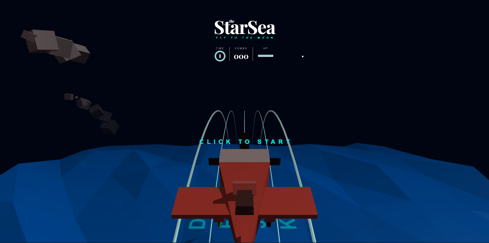
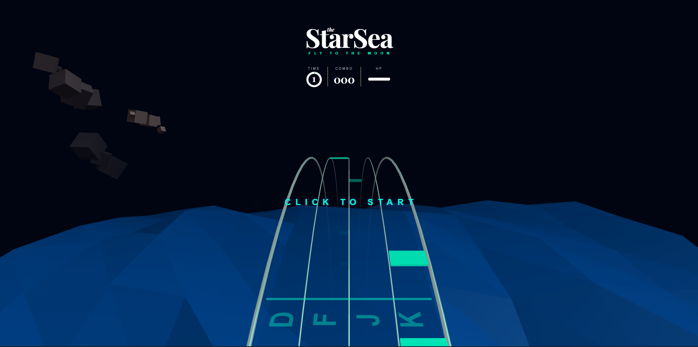

# StarSea_Airplane
Computer Graphics

`실행방법 : 터미널에 npm run dev -> 나오는 링크를 들어가서 플레이 할 것.`

## 1. 프로젝트 개요 및 기획
최대한 원본과 유사하나, 다른 식의 게임을 만들고자 하였다. 따라서 고심 끝에 우주바다란 감성의 리듬게임으로 바꾸는 것을 목표로 삼았다.

## 2. 게임 내용 및 개발 상세

* 게임 시작 화면.

* 음악이 로딩되는 동안은 시작되지 않도록 만들었다.

초기 단계에서 Three.js가 제공하는 하이레벨 라이브러리 함수에 의존하지 않고, 변환 행렬과 이동 행렬 연산을 직접 수학적으로 제어하는 것부터 시작했다. 
오브젝트의 위치 벡터를 업데이트하고 사차원 행렬의 각 성분에 회전 변환 값을 직접 대입하여 오브젝트의 트랜스레이션 및 로테이션 구조를 보존하고 제어할 수 있도록 구축해 두었다.

#### 3D 변환 행렬 및 쿼터니언 회전 구조 보존
비행기의 조작 및 이동 시, Three.js의 상위 Wrapper 함수인 `rotation.set`이나 `position.set`에만 의존하지 않고 로우레벨 파이프라인의 행렬 연산 메커니즘을 보존했다.
비행기 오브젝트의 위치 벡터(`Vector3`)와 방향성을 나타내는 쿼터니언(`Quaternion`), 스케일 벡터를 매 프레임 `Matrix4` 4차원 변환 행렬에 결합(Compose)시키는 `airplane.mesh.matrix.compose(...)` 연산을 직접 수행했다. 이 행렬 곱 연산 구조 덕분에 비행기가 좌우 레인으로 회전 보간할 때 3D 정점 데이터의 왜곡 없이 안정적인 변환 변형을 유지할 수 있었다.

그 다음, 리듬 게임으로의 메커니즘 개편을 진행했다. 
롱노트 패턴 대신 기본 노트를 트랙에 납작하게 밀착시켜 시각적 통일감을 주는 큐브 노트를 설계했고, 멀리 갈수록 조각의 X축 두께가 얇아져 가속감을 주는 잔상 이펙트를 구현하여 리듬 게임 특유의 속도감을 살렸다. 또한 138 BPM의 4/4 박자에 대응하기 위해 데이터와 로직을 분리하는 텍스트 기반 채보 파서 시스템을 구축하여 복잡한 박자 분할과 순차적 스폰을 제어했다.

#### 오디오 재생 시간 기반의 노트 위치 역산 알고리즘
매 프레임 일정한 이동 속도를 단순 합산하는 기존 프레임 기반 연산은 하드웨어 성능 및 프레임 드롭 발생 시 심각한 판정 엇박을 유발한다. 이를 해결하기 위해 Web Audio API의 절대 시간축인 `bgm.context.currentTime`을 기준 지표로 삼아 시간 동기화 시스템을 구축했다.
매 프레임 현재 재생 시간인 `currentAudioTime`과 각 노트 고유의 판정 시간인 `note.hitTime` 사이의 잔여 시간(`timeRemaining = note.hitTime - currentAudioTime`)을 구하고, 이를 트랙의 반경 $R=692$와 회전 각도 연산에 대입하여 위치를 실시간 역산 매핑했다. 
노트가 판정선에 도달할 때의 타격 타점 각도를 $\frac{\pi}{2}$ (X=0, Y=90)로 고정하고, 남은 시간에 비례하여 각도가 선형적으로 전진하도록 계산함으로써 시스템 성능에 무관한 판정 동기화를 달성했다.
* 연산 수식: `note.angle = hitZoneAngle - (timeRemaining * angleSpeed)`
* 위치 매핑: `position.x = Math.cos(note.angle) * 692`, `position.y = -600 + Math.sin(note.angle) * 692`

#### 비트 파서 시스템을 통한 동적 박자 분할 
채보의 데이터와 생성 로직을 완벽히 분리하기 위해 외부 `beatmap.txt` 파일을 Fetch API로 비동기 로드하는 파서 시스템을 구현했다. 4자리 문자열(예: `0040`, `1010`) 구조에서 각 라인의 정수 합(Total Notes)을 산출하여 1박자(Beat) 단위를 정밀하게 N등분하는 박자 분할 분해능 알고리즘을 설계했다.
`1010`과 같이 단일 박자 내에 다중 노트가 스폰될 경우, 좌측 라인부터 순서대로 sub-beat 간격을 누적 합산하여 물리적인 입사 시간을 다르게 분배해 줌으로써 정박과 엇박 연타 패턴을 유연하게 소화하도록 제어했다.
* 분할 수식: `subBeatInterval = SEC_PER_BEAT / totalNotes`
* 시간 할당: `hitTime = startOffset + (i * SEC_PER_BEAT) + (noteOffsetIndex * subBeatInterval)`

리듬 게임 전용 인터페이스로의 전환을 위해 기존의 레벨과 거리를 표기하던 UI를 각각 곡의 실시간 진행도를 나타내는 원형 프로그레스 바와 콤보 시스템으로 갱신했으며, 체력 게이지가 고갈되면 오디오 볼륨을 부드럽게 감소시키는 선형 페이드아웃 기능의 게임 오버 시스템까지 유기적으로 연결했다. 

최종적으로는 강의에서 다룬 실시간 글로벌 일루미네이션의 한계를 극복하기 위해, 대낮 조명을 제거하고 음원의 비트 및 타격 타이밍에 동기화된 화이트 밸런스 기반의 가상 간접광 반사 시스템을 주입하여 빨간 비행기 몸체와 푸른 바다가 상호작용하는 야간 연출을 완성하였다.

## 3. 글로벌 일루미네이션 (GI) 기술 적용 및 강의 매핑
`표면의 최종 색상 $L_o$는 오브젝트 고유의 발광 성분 $L_e$와 주변 환경에서 튕겨 들어오는 간접광 적분 항의 합으로 결정된다.`

자체 발광 항 ($L_e$): Note 클래스 및 createLanes() 함수 내에서 MeshStandardMaterial 객체를 생성할 때 emissive: 0x00ffcc 속성과 emissiveIntensity: 0.8 속성을 부여하여 셰이더 내부의 자기 발광 에너지 항을 직접 제어하도록 구현했다.

간접광 반사 항 ($\int_{\Omega} ...$): 실시간 패스트레이싱 연산이 불가능한 웹 브라우저의 성능 제약을 극복하기 위해, 판정선 상단 좌표에 동적 점광원 giLightBounce = new THREE.PointLight(0xffffff, 0, 1000, 1.0)을 배치했다. 노트를 타격하는 dynamic 이벤트 발생 시 광원의 강도를 연산하여, 빛이 사방으로 튕겨 나가 주변 사물에 영향을 주는 조도 변화를 근사하게 구현했다.

`DDGI는 간접 확산광이 급격한 변화가 없는 저주파 시그널이라는 특성을 이용해 L1 구면 조화 함수(L1 SH)로 에너지를 전파하며, infinite diffuse bounce를 위해 이전 프레임의 빛 결과를 누적한다.`

비행기 몸체의 고유 색상(Red)과 네온 빛(Cyan)의 색상 곱셈 연산 시 성분이 상쇄되어 빛 반사가 누락되는 현상을 방지하기 위해 가상 간접광의 색상을 화이트 밸런스(0xffffff)로 설정했다. 이를 통해 비행기는 R 성분을, 바다는 B/G 성분을 반사하여 각 오브젝트가 고유의 반사율(BRDF)에 따라 자연스럽게 간접광을 표현하도록 유도했다.

SH 계수 연산 대신 loop() 함수 내부에서 giLightBounce.intensity += (pulseIntensity - giLightBounce.intensity) * 0.1 이라는 선형 보간 수식을 매 프레임 구동했다. 빛 에너지가 순간적으로 소멸하지 않고 프레임 간에 부드럽게 누적되며 감쇄 전파되도록 설계함으로써 DDGI의 convergence 메커니즘을 저비용 핑퐁 알고리즘으로 근사하게 구현했다.

`실시간 변동 장면에서 기하학적 파편의 소멸이나 급격한 광량 변화에 따라 프레임 간 입사 에너지 시그널이 급격히 변화하는 현상을 에뮬레이션한다.`

NotesHolder.prototype.updateNotes 내에서 비행기 실제 X 좌표 위치와 노트의 hitTime 오차 범위가 타격 성공 판정(Math.abs(timeRemaining) < 0.08)을 트리거하는 순간, giLightBounce.intensity 값을 순식간에 45.0으로 폭발시키는 메커니즘을 구현했다. 이를 통해 순간적으로 전경의 조도를 극대화했다가 선형 보간 알고리즘으로 감쇄시키는 동적 글로벌 일루미네이션 변화를 구현했다.
